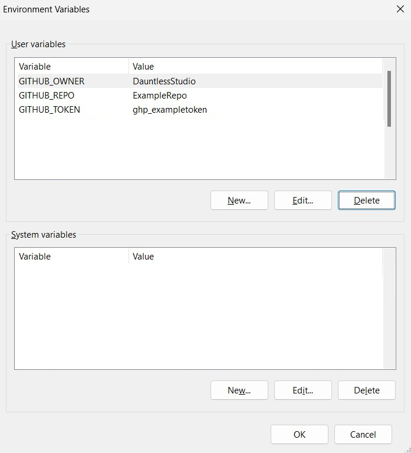

# Commands
Comprehensive list of all commands, with example uses.
- [Commands](#commands)
    - [General (bed)](#general-usage)
    - [Create New Files (new)](#create-new-files)
        - [Create New Entity (new entity)](#create-new-entity)
        - [Create New Item (new item)](#create-new-item)
        - [Create New Block (new block)](#create-new-block)
        - [Create New Animation (new anim)](#create-new-animation)
        - [Create New Animation Controller (new ctrl)](#create-new-animation-controller)
        - [Create New Function (new function)](#create-new-function)
        - [Import Vanilla Entity (new vanilla)](#import-vanilla-entity)
    - [Modify Entities (entity)](#modify-entities)
        - [Add Animations To Entities (entity anim)](#add-animations-to-entities)
        - [Add Component Groups To Entities (entity group)](#add-component-groups-to-entities)
        - [Add Components To Entities (entity component)](#add-components-to-entities)
        - [Add Damage Sensors To Entities (entity sensor)](#add-damage-sensors-to-entities)
        - [Add Properties To Entities (entity property)](#add-properties-to-entities)
            - [Add Property Definition (entity property add)](#add-property-definition)
            - [Add Property Events (entity property event)](#add-property-events)
    - [Package Manager (pkg)](#package-manager)
        - [List Packages (pkg list)](#list-packages)
        - [Import Packages (pkg import)](#import-packages)

## General Usage
CLI to assist Minecraft Bedrock Development. This is the root command, and all other commands are subcommands of this. At the root, you can specify certain paramaters that are globally used, like the paths to the Behavior Pack and Resource Pack, or the indent level for files.

In most use cases, the `--rpath` and `--bpath` are not needed, as when used within a project, the paths will be automatically determined.

The root command has the version and help arguments.

```
Usage: bed [options] [command]

Options:
  --rpath <rp>           Path to Resource Pack
  --bpath <bp>           Path to Behavior Pack
  -i, --indent <number>  set indent tabs level for JSON files (default: "1")
  -v, --version          output the version number
  -h, --help             display help for command

Commands:
  new                    Creates new Bedrock files
  entity                 Modifies Bedrock entities
  pkg                    Package manager for Bedrock files
```
### Example(s)
---
```
bed -v
```
This outputs the current version of the tool, such as `1.0.0`.

---
```
bed -h
```
This outputs the basic help, listing the available options and subcommands.

&nbsp;

---
## Create New Files
Creates new Bedrock files. This is the general command that creates new files such as: entities, items, blocks, etc. The various types of files that can be created are subcommands of `new`.
```
Usage: bed new [options] [command]

Options:
  -h, --help                     display help for command

Commands:
  entity [options] <names...>    Creates new Bedrock entities
  item [options] <names...>      Creates new Bedrock items
  block [options] <names...>     Creates new Bedrock blocks
  anim [options] <names...>      Creates new Bedrock behavior animations
  ctrl [options] <names...>      Creates new Bedrock behavior animation controllers
  function [options] <names...>  Creates new Bedrock functions
  vanilla [options] <names...>   Imports a vanilla Bedrock entity
  help [command]                 display help for command
```

&nbsp;

---
## Create New Entity
Creates new Bedrock entities. This command creates entities of various types, and can speed up the repetitive steps involved with creating entity files.
```
Usage: bed new entity [options] <names...>

Arguments:
  names              entity names as "namespace:entity"

Options:
  -l, --lang         add lang file
  -t, --type <char>  set entity type: dummy, passive, hostile (choices: "d", "h", "p", default: dummy)
  -c, --client       create client entity in the resource path. Will also create a default geo and texture for the entity
  -h, --help         display help for command
```
### Example(s)
---
```
bed new entity ldz:test
```
This outputs a file at `BP/entities/test.json`, creating a dummy entity with basic components all dummy entities share, including a despawn event that gets called when the entity takes void damage.

---
```
bed new entity --type h --client --lang ldz:test
```
This specifies that the entity should be hostile, that it should create the client files (the rp entity, geo, and texture files), and that lines will be added to the lang file. The lang file gets the Entity Name, and because it is hostile or passive, rather than a dummy it will also create a Spawn Egg entry.

&nbsp;

---
## Create New Item
Creates new Bedrock items. This command creates items of various types, and can speed up the repetitive steps involved with creating item files.
```
Usage: bed new item [options] <names...>

Arguments:
  names                     item names as "namespace:item"

Options:
  --no-lang                 do not add lang file
  -s, --stack <stack_size>  max stack size (default: "64")
  -t, --type <item_type>    basic (choices: "basic", "weapon", "projectile", "food", "armor_set", "helmet", "chestplate", "leggings", "boots")
  -h, --help                display help for command
```
### Example(s)
---
```
bed new item ldz:test_item
```
This creates an item with all defaults, making a basic item with a stack size of 64. It creates files at `BP/items/test_item.json`, `RP/items/test_item.json`, and creates/modifies `RP/textures/item_texture.json` adding in a references to the new texture created at `RP/textures/items/test_item.png`, additionally since we did not specify `--no-lang` we add a lang file entry to the category `## ITEM NAMES`.

---
```
bed new item --type weapon --stack 1 ldz:test_weapon
```
This is the syntax for creating an attachable. In addition to all the files mentioned in the previous example, this adds an `RP/entity/player.entity.json` with all the variables and animations needed for attachables, along with the attachable file, modifications to the player animations, and a custom geo and texture for the new attachable.

---
```
bed new item --type armor_set ldz:test_armor
```
This creates an **experimental** armor set. Generating helmet, chestplate, leggings, and boots items, setting up their item files with all the required setup for armor, and the attachable files with textures and item sprites, along with lang file entries.

Note that in this case, we don't need to specify `--stack 1` since the armor type will automatically set the stack size to 1. Additionally armor generated this way will have `minecraft:stick` as the default repair material.

&nbsp;

---
## Create New Block
Creates new Bedrock blocks. This command creates blocks, and can speed up the repetitive steps involved with creating block files.

```
Usage: bed new block [options] <names...>

Arguments:
  names                      block names as "namespace:block"

Options:
  -l, --lang                 add lang file
  -e, --emissive <emission>  block emmission level [0.0-1.0]
  -t, --table                create a loot table
  -h, --help                 display help for command
```
### Example(s)
---
```
bed new block --lang ldz:test_block
```
This creates a new simple block with an empty loot table and a lang file reference. A block file, as well as a texture and terrain_texture entity are generated.

---
```
bed new block --emissive 1.0 --table --lang ldz:test_lit_block
```
This creates a new block that emits light level 15, a new loot table that drops itself, along with everything listed in the above example.

&nbsp;

---
## Create New Animation
Creates new Bedrock behavior animations.

```
Usage: bed new anim [options] <names...>

Arguments:
  names                      animation names names as "entity.anim"

Options:
  -l, --loop                    should the animation loop
  -c, --commands <commands...>  the commands to play (default: ["/say anim_name"])
  -t, --time <time>             the animation length (default: 1)
  -h, --help                    display help for command
```
### Example(s)
---
```
bed new anim generic.test
```
This outputs an animation with all defaults, an animation length of 1 seconds, non-looping, and a say command with the animation name.
```json
{
	"format_version": "1.16.0",
	"animations": {
		"animation.generic.test": {
			"animation_length": 1,
			"timeline": {
				"0.0": [
					"/say test"
				]
			}
		}
	}
}
```
&nbsp;

---
## Create New Animation Controller
Creates new Bedrock behavior animation controllers.

```
Usage: bed new ctrl [options] <names...>

Arguments:
  names                            controller names as "entity.anim"

Options:
  -e, --entry [on entry commands...]  the commands to play on entry (default: ["/say anim_name"])
  -x, --exit [on exit commands...]    the commands to play on exit (preset: ["/say anim_name"])
  -a, --anim <animations...>          the animations to play
  -q, --query [query]                 the query to transition from default (default: "true")
  -t, --transition [transition]       the query to transition back to default (preset: "true")
  -h, --help                          display help for command
```
### Example(s)
---
```
bed new ctrl generic.test
```
This outputs an animation controller with all the defaults. An on_entry that says the controller name, a transition to `test` with the condition of true, no transition back to `default`, no animations, and no on_exit.
```json
{
	"format_version": "1.19.0",
	"animation_controllers": {
		"controller.animation.generic.test": {
			"initial_state": "default",
			"states": {
				"default": {
					"transitions": [
						{
							"test": "true"
						}
					]
				},
				"test": {
					"on_entry": [
						"/say Entered test"
					]
				}
			}
		}
	}
}
```
---
```
bed new ctrl --entry "/say Entered" --query q.is_jumping --transition !q.is_jumping --exit "/say Exited" generic.new_test
```
This outputs a more complex controller with specified transition queries and specific commands in on_entry and on_exit.
```json
{
	"format_version": "1.19.0",
	"animation_controllers": {
		"controller.animation.generic.new_test": {
			"initial_state": "default",
			"states": {
				"default": {
					"transitions": [
						{
							"new_test": "q.is_jumping"
						}
					]
				},
				"new_test": {
					"on_entry": [
						"/say Entered"
					],
					"transitions": [
						{
							"default": "!q.is_jumping"
						}
					],
					"on_exit": [
						"/say Exited"
					]
				}
			}
		}
	}
}
```

&nbsp;

---
## Create New Function
Creates new Bedrock functions. When creating functions, you can use special characters to add data into the command: `$f` inserts the filename into the command, `$i` inserts the index of the batch generated command
```
Usage: bed new function [options] <names...>

Arguments:
  names                            function names as "foo/bar"

Options:
  -c, --commands <commands>        the function commands, seperated by ";"
  -n, --number <number>            the number of times commands should be created in the files (default: "1")
  -d, --description <description>  the description of the function to be used as a comment
  -s, --source <source>            where is this function called from, used as a comment
  -h, --help                       display help for command
```
### Example(s)
---
```
bed new function foo
```
This creates a new function at `BP/functions/foo.mcfunction` with the defaults, automatically creating a `say foo` command and creating a description with the command's title and an unknown source.
```mcfunction
## FOO
## CALLED FROM ???

say foo
```
---
```
bed new function --description "A test function" --source "a developer" --commands "execute as @s[tag=dev] run say this is a test" admin/test
```
Here we specify the function's description, where it's called from, and what command it should run. Additionally we specify the folder it should go in, so at `BP/functions/admin/test.mcfunction` we have:
```mcfunction
## A TEST FUNCTION
## A DEVELOPER FUNCTION

execute as @s[tag=dev] run say this is a test
```
---
```
bed new function --commands "scoreboard players set @s Count $i;say My score is $i" --number 50 player/set_coun
t
```
This creates a function at `BP/functions/player/set_count` where the two commands included as args are repeated 50 times, with the values between 1-50 inserted where `$i` appears.
```mcfunction
## SET_COUNT
## CALLED FROM ???

scoreboard players set @s Count 1
say My score is 1
scoreboard players set @s Count 2
say My score is 2
scoreboard players set @s Count 3
say My score is 3
scoreboard players set @s Count 4
say My score is 4
scoreboard players set @s Count 5
say My score is 5
scoreboard players set @s Count 6
say My score is 6
scoreboard players set @s Count 7
say My score is 7
scoreboard players set @s Count 8
say My score is 8
scoreboard players set @s Count 9
say My score is 9
scoreboard players set @s Count 10
say My score is 10
...
```

&nbsp;

---
## Import Vanilla Entity
Imports a vanilla Bedrock entity. This command will import an entity from [Mojang's Bedrock Samples](https://github.com/Mojang/bedrock-samples). This supports partial [glob patterns](https://en.wikipedia.org/wiki/Glob_(programming)), so *.json would import all the entities in the BP/entities folder.
```
Usage: bed new vanilla [options] <names...>

Arguments:
  names         entity files as "player.json"

Options:
  -c, --client  create client entity in the resource path
  -h, --help    display help for command
```
### Example(s)
---
```
bed new vanilla player.json
```
This imports the player.json file, copied directly from Mojang's repository so it will always import the most up-to-date version of the file.
```
bed new vanilla --client pig.json
```
The `--client` argument means we'll also import the `pig.entity.json` file into the project.

&nbsp;

---
## Modify Entities
Modifies Bedrock entities. Rather than creating files, these commands will modify existing entities, adding things like animation references, components, and properties. 

Most of these commands require a `--file [file]` option, preset to `**/*.json` which is a [glob pattern](https://en.wikipedia.org/wiki/Glob_(programming)) for every .json file in `BP/entities`. If you provide `--file` without any value, it will default ot every entity, but you can specify a direct filename with `player.json`, every file in a certain folder like `vanilla/*.json`, or every entity that ends with 'skeleton' with `*skeleton.json`.

Most commands also accept a `--type <family type>` which further filters the entities, only getting entities with a certain family type. So the options `--file **/*.json --family horse` will grab every file that includes the family type 'horse', even if that family type only exists in component group.
```
Usage: bed entity [options] [command]

Options:
  -h, --help                       display help for command

Commands:
  anim [options] <names...>        Adds an animation or animation controller reference to entities
  group [options] <group>          Adds a component group to entities
  component [options] <component>  Adds a component to entities
  sensor [options] <sensor>        Adds a damage sensor to entities
  property                         Adds property or property events to entities
  help [command]                   display help for command
```

&nbsp;

---
## Add Animations To Entities
Adds an animation or animation controller reference to entities.
```
Usage: bed entity anim [options] <names...>

Arguments:
  names                     animation names as "entity.anim"

Options:
  -t, --type <family type>  filter entities by family type
  -f, --file [file]         the entity files that should be modified (preset: "**/*.json")
  -s, --script              should these animations be added to script
  -c, --create [anim type]  create the animation as well (choices: "ctrl", "anim", preset: "ctrl")
  -h, --help                display help for command
```
### Example(s)
---
```
bed entity anim --file player.json --script player.test
```
This will attempt to find an animation, or controller called 'player.test'. If it finds it, it will add that reference to the player file, automatically determining whether it is an animation or animation controller, and because we included the `--script` option, it will add it to `animate>scripts`.

---
```
bed entity anim --file player.json --script --create ctrl player.test
```
The inclusion of the `--create anim | --create ctrl` option effectively combines this command with `bed new anim | bed new ctrl` depending on the provided value. This can streamline the creation of animations/controllers and the adding of them to an entity.

This will create the controller or animation with all default values.

&nbsp;

---
## Add Components To Entities
Adds a component to entities. This can be used to batch add a component to every entity. By default, this will merge the new object with the old one (if it exists), although you can provide the overwrite option.

Note that this will **not** check if the component you are trying to add is a real Minecraft component, only if the JSON itself is valid.

```
Usage: bed entity component [options] <component>

Arguments:
  component                 the component as a json object {minecraft:is_baby:{}}

Options:
  -t, --type <family type>  filter entities by family type
  -f, --file [file]         the entity files that should be modified (preset: "**/*.json")
  -o, --overwrite           should the new component overwrite the old one rather than merge with it?
  -h, --help                display help for command
```
### Example(s)
---
```
bed entity component --file player.json {minecraft:is_baby:{}}
```
This adds the `minecraft:is_baby` component to the player.

---
```
bed entity component --file player.json {minecraft:type_family:{family:[\"test\"]}}
```
Since the `minecraft:type_family` already exists on the player, this will **combine** the components together:
```json
{
	"minecraft:type_family": {
		"family": [
			"player",
			"test"
		]
	}
}
```
---
```
bed entity component --file player.json --overwrite {minecraft:type_family:{family:[\"test\"]}}
```
Even though the `minecraft:type_family` already exists on the player, this will **overwrite** the old component with the new since we used it with the `--overwrite` option:
```json
{
	"minecraft:type_family": {
		"family": [
			"test"
		]
	}
}
```

&nbsp;

---
## Add Component Groups To Entities
Adds a component group to entities. This accepts a JSON object that will get added to the entities' component groups.
```
Usage: bed entity group [options] <group>

Arguments:
  group                     the component group as a json object {group_name:{minecraft:is_baby:{}}}

Options:
  -t, --type <family type>  filter entities by family type
  -f, --file [file]         the entity files that should be modified (preset: "**/*.json")
  -h, --help                display help for command
```
### Example(s)
---
```
bed entity group --file player.json {new_group:{}}
```
This adds an empty component group `new_group`, and two events `add_new_group` and `remove_new_group` that do exactly what you'd expect.
```
bed entity group {new_loot:{minecraft:loot:{table:\"loot_tables/custom.json\"}}}
``` 
This adds a group to every single entity that looks like this:
```json
{
  "new_loot": {
				"minecraft:loot": {
					"table": "loot_tables/custom.json"
				}
			}
}
```
Notice that when writing the command, we escaped the quotes with \\", that prevents the command line from interpretting the input and losing the quotes. Without the quotes you will get feedback saying:
```
Invalid JSON: {new_loot:{minecraft:loot:{table:loot_tables/custom.json}}}
```
___
```
bed entity group {new_group:{$minecraft:type_family:{family:[\"test\"]}}} --file
```
The `$` decorator here tells the command to **merge** `minecraft:type_family` from the source file rather than overwrite it, resulting in:
```json
{
    "new_group": {
        "minecraft:type_family": {
            "family": [
                "player",
                "test"
            ]
        }
    }
}
```

&nbsp;

---
## Add Damage Sensors To Entities
Adds a damage sensor to entities. This is especially helpful when you need to add a damage sensor filter to every single mob.

```
Usage: bed entity sensor [options] <sensor>

Arguments:
  sensor                    the damage sensor as a json object {cause: \"all\", deals_damage: false}

Options:
  -t, --type <family type>  filter entities by family type
  -f, --file [file]         the entity files that should be modified (preset: "**/*.json")
  -s, --start               adds the new sensor to the start of the array, rather than the end
  -h, --help                display help for command
```
### Example(s)
---
```
bed entity sensor {cause:\"all\",deals_damage:false}
```
This adds a damage sensor entry to every entity in the project, it will add a damage sensor to the entity if it's missing one, and convert the sensor to an array if it's currently an object, the above command would add an entry like this:
```json
{
	"cause": "all",
	"deals_damage": false
}
```
---
The damage sensor entries from this command are always added to the bottom of the list, so all the other damage sensors will be executed first. But you can add your custom sensor to the top of the list with:
```
bed entity sensor --start {cause:\"all\",deals_damage:false}
```
---
```
bed entity sensor --file player.json {cause:\"fire\",deals_damage:false,on_damage:{event:\"add_extinguish\"}}
```
We can add more complex events, triggering events as well.

&nbsp;

---
## Add Properties To Entities
Adds property or property events to entities.

```
Usage: bed entity property [options] [command]

Options:
  -h, --help                   display help for command

Commands:
  add [options] <names...>     Adds a property to entities
  event [options] <values...>  Adds a property event to entities
  help [command]               display help for command
```

&nbsp;

---
## Add Property Definition
Adds a property to entities. When creating a property it will attempt to automatically convert the values to the appropriate type.

```
Usage: bed entity property add [options] <names...>

Arguments:
  names                           property names as "namespace:property"

Options:
  -t, --type <family type>        filter entities by family type
  -f, --file <file>               the entity files that should be modified (default: "**/*.json")
  -p, --property <property type>  the type of property (choices: "bool", "enum", "float", "int", default: "bool")
  -v, --values <values...>        the values, either a list of enum values or a min-max
  -d, --default <default>         the default value
  -c, --client                    should use client_sync
  -e, --event                     automatically generate events for the values
  -h, --help                      display help for command
```
### Example(s)
---
```
bed entity property add --file player.json --property int --values 1 10 --default 1 ldz:int_prop
```
This command modifies the player.json file, sets the property type to int, with a value range of 1-10, a default of 1, and a title of ldz:int_prop. Outputting as follows:
```json
{
	"ldz:int_prop": {
		"type": "int",
		"range": [
			1,
			10
		],
		"default": 1
	}
}
```
---
Notice what happens if we use the exact same command, but change the property type to enum though.
```
bed entity property add --file player.json --property enum --values 1 10 --default 1 ldz:enum_prop
```
Now our output is:
```json
{
    "ldz:enum_prop": {
        "type": "enum",
        "values": [
            "1",
            "10"
        ],
        "default": "1"
    }
}
```
The `range` property that is appropriate for int and floats has been changed to `values` as appropriate for enums. Additionally, the entries in `values` and `defualt` have automatically been converted to strings instead of numbers. 

---
```
bed entity property add --file player.json --property int --values 1 10 --default 1 --event ldz:int_prop
```
The `--event` option combines the effects of `bed entity property event` into this command, and will automatically generate an event for every value. So in this case 10 events are created `set_int_prop_to_1`, `set_int_prop_to_2`, etc. up to 10. This can streamline the creation of properties and the events you're likely to add.

---
Note that if your value can't be properly converted to a value, it will default to a string.

&nbsp;

---
## Add Property Events
Adds a property event to entities. This command will fail if you try to create an event on an entity that doesn't implement the property you are trying to set.
```
Arguments:
  values                          the values to set the property to

Options:
  -t, --type <family type>        filter entities by family type
  -f, --file <file>               the entity files that should be modified (default: "**/*.json")
  -p, --property <property name>  the name of the property to set
  -e, --event <event name>        a custom event name, otherwise defaults to "set_property_to_value
  -h, --help                      display help for command
```
### Example(s)
---
```
bed entity property event --file player.json --property ldz:int_prop 1 2 3 4 5
```
This creates five new events called `set_int_prop_to_1`, `set_int_prop_to_2`, etc. which set `ldz:int_prop` to the specified value.

---
As with `property add`, this command will automatically determine what type the values should be. If we run the same command again, but this time with `ldz:enum_prop` as the target.
```
bed entity property event --file player.json --property ldz:enum_prop 1 2 3 4 5
```
Then our outputs become:
```json
{
    "set_enum_prop_to_1": {
        "set_property": {
            "ldz:enum_prop": "1"
        }
    },
    ...
}
```
Automatically changing `1` to `"1"` since the property was an enum.

---
If the value can't be converted cleanly (like trying to turn "abc" into an int), then the value defaults to a string. This is to allow for things like:
```
bed entity property event --file player.json --property ldz:int_prop q.property('ldz:int_prop')+1
```
This creates the output:
```json
{
    "set_int_prop_to_q.property('ldz:int_prop')+1": {
        "set_property": {
            "ldz:int_prop": "q.property('ldz:int_prop')+1"
        }
    }
}
```
This is great, but we probably don't want our event to be called `set_int_prop_to_q.property('ldz:int_prop')+1`, so we can specify our own event name with `--event` option.
```
bed entity property event --file player.json --property ldz:int_prop --event add_1_to_int_prop q.property('ldz:int_prop')+1
```
Here we specify the event name, so the output becomes:
```json
{
    "add_1_to_int_prop": {
        "set_property": {
            "ldz:int_prop": "q.property('ldz:int_prop')+1"
        }
    }
}
```
Much better.

---
This command won't run on an entity that doesn't implement the property. This is to avoid errors from setting properties that don't exist, but it can be helpful for another reason.
```
bed entity property event --property ldz:int_prop 10
```
Let's say our project in this example has three entities: pig, player, and skeleton. Of these three, only the player has the `ldz:int_property`. And since entity commands without a `--file` or `--type` specified will automatically affect every entity in the project, we get the output:
```
ldz:int_prop not found on ./behavior_packs/entities/pig.json
Failed to write to ./behavior_packs/entities/pig.json
Wrote JSON to: ./behavior_packs/entities/player.json
ldz:int_prop not found on ./behavior_packs/entities/skeleton.json
Failed to write to ./behavior_packs/entities/skeleton.json
```
The command didn't write pig.json or skeleton.json, but it did write to player.json. So this can be a quick way to add property events to every entity that actually uses that property.

&nbsp;

---
## Package Manager
Package manager for Bedrock files. We use a special method of using a GitHub repository as a package storage solution. 
### Setting Up (For Admins)
This requires your repository to be configured in a very specific way:
```
package_repo
| packages.json
|
└─Example Package 1
| └─RP
| | └─entity
| | | | example.entity.json
| | | |
| | └─models
| | | └─entity
| | | | | example.geo.json
| | | | |
| | └─textures
| | | └─example
| | | | | default.png
| | | | |
| | └─texts
| | | | en_US.lang
| | | |
| └─BP
| | └─entities
| |   | example.json
| |   |
| | README.md
|
└─Example Package 2
...
```
The important takeaways here are:
- Each individual package should be contained in its own folder at the root of your project.
- Packages should have a `BP` folder that acts as the root of a `behavior_pack` and contents inside will be added into your project.
- Packages should have a `RP` folder that acts as the root of a `resource_pack` and contents inside will be added into your project.
- Both `BP` and `RP` are optional. If your package only contains a particle effect for example, then you would only need a `RP` folder and don't need to include a `BP`.
- The packages.json folder is what is specifically read to find your packages, and should be laid out as:
```json
[
    {
        "name": "example_package_1",
        "display_name": "Example Package 1",
        "description": "An example entity.",
        "categories": [
            "entity"
        ],
        "index": 0,
        "repository": {
            "url": "https://api.github.com/repos/{ORGANIZATION}/{REPO}/contents/Example%20Package%201?ref=main"
        }
    },
    {
        "name": "example_package_2",
        "display_name": "Example Package 2",
        "description": "An example particle.",
        "categories": [
            "particle"
        ],
        "index": 1,
        "repository": {
            "url": "https://api.github.com/repos/{ORGANIZATION}/{REPO}/contents/Example%20Package%202?ref=main"
        }
    }
]
```
The `name` can be whatever you like, but `display_name` is what will actually be seen by users. `description` provides additional details when `bed pkg list --detailed` is run, and should be a concise 1-2 sentance description, a more detailed explanation can be in the README for that package. `categories` can be used to help filter the package list if you have a lot of packages. `repository>url` is very important as this is the actual path to your package that will be downloaded. `{Organization}` should be replaced by the name of your user or organization name, i.e. `DauntlessStudio`, and `{REPO}` should be replaced by the repository name where you store your packages. The last section `contents/...?ref=main`, ... should be replaced with the title of your folder, i.e. `Example Package 1`, with `%20` instead of spaces, so `Example%20Package%201`.

### Setting Up (For Users)
Rather than manually specifying the Organization and Repo each time you use the program, it will check your Environment Variables, so they should be configured as:




If you aren't familiar with how to create your own GitHub token, talk to your packages administrator or follow this [guide](https://docs.github.com/en/enterprise-server@3.4/authentication/keeping-your-account-and-data-secure/creating-a-personal-access-token).

```
Usage: bed pkg [options] [command]

Options:
  -h, --help            display help for command

Commands:
  list [options]        List packages at repo
  import <packages...>  import packages from repo
  help [command]        display help for command
```

&nbsp;

---
## List Packages
List packages in repo.

```
Usage: bed pkg list [options]

Options:
  -d, --detailed        gets extra details about the package, if available
  -f --filter <filter>  filter the packages by name or category
  -h, --help            display help for command
```
### Example(s)
---
```
bed pkg list --detailed
```
Lists all of the available packages, and a short description of them. An example output might be:
```
[0] Example Package 1
      An example entity.
[1] Example Package 2
      An example particle.
```
---
You can filter this list by category, or searching what appears in the title.
```
bed pkg list --detailed --filter 1
bed pkg list --detailed --filter entity
```
Either of these commands would produce the filtered list:
```
[0] Example Package 1
      An example entity.
```
Since `1` only appears in the title `Example Package 1` and that is the only package that includes the `entity` category.
&nbsp;

---
## Import Packages
import packages from repo.

```
Usage: bed pkg import [options] <packages...>

Arguments:
  packages    the packages to import as either index value or name

Options:
  -h, --help  display help for command
```
### Example(s)
---
You can import a package by title or index. So based on the examples from [List Packages](#list-packages):
```
bed pkg import 0
bed pkg import "Example Package 1"
```
Would both import the first package `Example Package 1`.

&nbsp;

---
